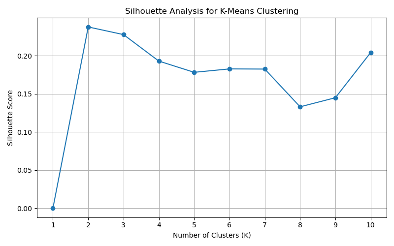

# Text Clustering and NLP Analysis

## 📌 Project Overview
This project implements an unsupervised machine learning pipeline to group text documents based on semantic similarity. It demonstrates the ability to transform raw text into meaningful clusters using Natural Language Processing (NLP) techniques and dimensionality reduction.

## 🛠️ Technical Workflow
1. **Text Preprocessing:** - Normalisation (lowercasing, whitespace removal).
   - **TF-IDF Vectorisation** to convert text into a numerical format while handling stop words and word frequency.
2. **Dimensionality Reduction:** - Applied **TruncatedSVD (Latent Semantic Analysis)** to reduce a 1000-dimensional feature space to 50 core components, significantly improving clustering stability and reducing noise.
3. **Clustering Algorithm:** - Implemented **K-Means Clustering**.
   - Conducted **Silhouette Analysis** for $K \in [2, 10]$ to identify the optimal number of clusters.
4. **Evaluation:**
   - Determined the best $K$ value based on the highest silhouette score.

## 📈 Key Results
- **Optimal Clusters:** $K=2$ was identified as the most effective grouping.
- **Dimensionality Impact:** Reducing features via SVD increased the silhouette score from ~0.03 to **0.2379**, proving the importance of noise reduction in high-dimensional text data.

## 📂 File Structure
- `clustering.py`: Main script for model fitting and evaluation.
- `preprocessing.py`: Module for text cleaning and feature engineering.
- `silhouette_plot.png`: Visualisation of silhouette scores across different K values.
- `data_train.txt`: The input dataset consisting of 1,760 text instances.

## 📊 Visualizations
### Silhouette Analysis
We used the silhouette coefficient to evaluate the density and separation of the formed clusters. The plot below illustrates that $K=2$ yields the highest score.

